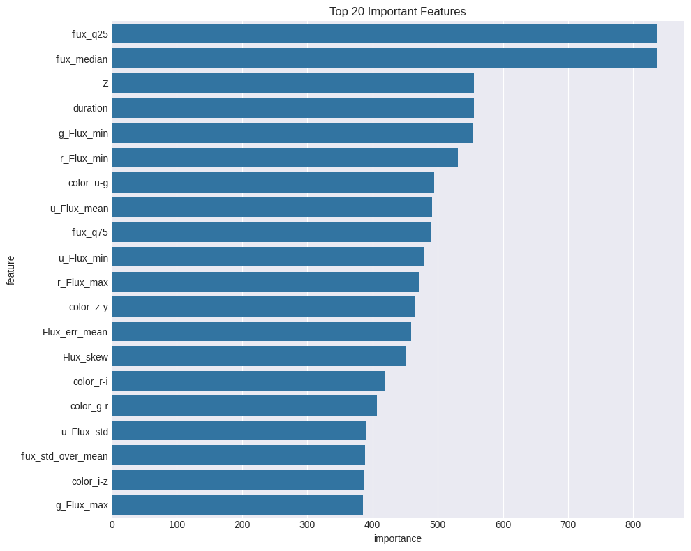

# 🌌 Mallorn Astronomical Classification Challenge - Machine Learning Solution

Repository này chứa giải pháp Machine Learning hoàn chỉnh cho cuộc thi **Mallorn Astronomical Classification Challenge**. Dự án tập trung vào việc phân loại các đối tượng thiên văn dựa trên dữ liệu chuỗi thời gian ánh sáng (Lightcurves) bằng cách sử dụng mô hình **LightGBM** kết hợp với kỹ thuật **Feature Engineering** chuyên sâu.

🔗 **Link Challenge:** [https://www.kaggle.com/competitions/mallorn-astronomical-classification-challenge](https://www.kaggle.com/competitions/mallorn-astronomical-classification-challenge).

## 📌 Tổng Quan Dự Án

* **Mục tiêu:** Phân loại các đối tượng thiên văn thành 2 lớp (Class 0 và Class 1) dựa trên dữ liệu trắc quang (photometric data) từ các bộ lọc màu khác nhau (u, g, r, i, z, y).
* **Thách thức chính:** Dữ liệu mất cân bằng nghiêm trọng (Class 0 chiếm đa số ~95%), chuỗi thời gian thưa thớt và nhiễu.
* **Kết quả đạt được:**
    * **Public Leaderboard Score:** 0.3515
    * **Cross-Validation F1-Macro:** 0.6757
    * **Accuracy:** ~94.5%

## 📂 Cấu Trúc Thư Mục

```text
├── mallorn-training.ipynb       # File Notebook chính chứa toàn bộ pipeline (EDA -> Preprocessing -> Modeling -> Eval)
├── results/                     # Thư mục chứa kết quả đầu ra
│   ├── extracted_features.csv   # File chứa các đặc trưng đã trích xuất (Features Cache)
│   ├── lgb_model_fold_0.txt     # Model LightGBM đã train (Fold 1)
│   ├── lgb_model_fold_1.txt     # Model LightGBM đã train (Fold 2)
│   ├── lgb_model_fold_2.txt     # Model LightGBM đã train (Fold 3)
│   ├── lgb_model_fold_3.txt     # Model LightGBM đã train (Fold 4)
│   ├── lgb_model_fold_4.txt     # Model LightGBM đã train (Fold 5)
│   ├── submission.csv           # File kết quả dự đoán cuối cùng
│   └── __results___files/       
│       └── __results___15_1.png # Biểu đồ Feature Importance
└── README.md                    # Tài liệu hướng dẫn
```

## 🚀 Phương Pháp Tiếp Cận (Methodology)
Giải pháp được xây dựng dựa trên các bước chính sau:

### 1. Xử lý dữ liệu (Data Preprocessing)
* **Tự động quét và gộp dữ liệu Lightcurves từ các thư mục split_xx.**
* **Kết hợp dữ liệu chuỗi thời gian với dữ liệu metadata (train_log.csv).**

### 2. Trích chọn đặc trưng (Feature Engineering) - Chìa khóa thành công
Thay vì đưa chuỗi thời gian thô vào mô hình, tôi đã chuyển đổi sang dạng bảng (Tabular) thông qua các đặc trưng thống kê và vật lý thiên văn:
  * **Thống kê cơ bản:** Min, Max, Mean, Std, Skewness của Flux trên từng dải sóng (Passband).
  * **Phân phối:** Các giá trị Percentile (25%, 50%, 75%) và phạm vi Flux loại bỏ outlier (Range 90%).
  * **Đặc trưng thời gian:** Thời gian quan sát (Duration), số lượng điểm đo (Count), độ dốc thay đổi độ sáng (Slope calculated via Linear Regression).
  * **Astronomical Colors (Quan trọng nhất):** Tính toán chỉ số màu (Color Indices) bằng hiệu số Flux trung bình giữa các dải sóng lân cận (ví dụ: u-g, g-r, r-i...). Đây là đặc trưng vật lý quan trọng để phân loại sao.
  * **Tỷ lệ:** Flux Standard Deviation / Mean (Signal-to-Noise proxy).

### 3. Mô hình hóa (Modeling)
* **Thuật toán:** LightGBM (Light Gradient Boosting Machine).
* **Cấu hình tối ưu:**
  * **Sử dụng Stratified K-Fold Cross-Validation (5 folds) để đảm bảo tính ổn định.**
  * **Xử lý mất cân bằng dữ liệu bằng tham số is_unbalance=True.**
  * **Learning rate thấp (0.03) kết hợp với Early Stopping để tránh Overfitting.**
  * **Bagging fraction và Feature fraction (0.8) để tăng tính tổng quát hóa.**

### 4. Tối ưu hóa ngưỡng (Threshold Tuning)
Do dữ liệu mất cân bằng, ngưỡng mặc định 0.5 không hiệu quả. Tôi đã áp dụng thuật toán tìm ngưỡng tối ưu dựa trên chỉ số F1-Macro.
  * **Ngưỡng tối ưu tìm được:** 0.26 (Thay vì 0.5).
  * **Giúp tăng khả năng phát hiện lớp thiểu số (Class 1) đáng kể.**

## 📊 Kết Quả Chi Tiết (Performance)
* **Cross-Validation Results (5 Folds):**

```
| Fold | Best Threshold | F1-Macro |
|------|----------------|----------|
| 1    | 0.25           | 0.6636   |
| 2    | 0.10           | 0.6546   |
| 3    | 0.25           | 0.6796   |
| 4    | 0.25           | 0.7196   |
| 5    | 0.30           | 0.6903   |
| **AVG** | **0.26**    | **0.6757** |
```
* **Feature Importance:**
Biểu đồ dưới đây thể hiện tầm quan trọng của các đặc trưng, cho thấy các chỉ số màu và thống kê Flux đóng vai trò quyết định.



## 🛠️ Hướng Dẫn Chạy trên Kaggle (Khuyên dùng)

Mô hình này được thiết kế và tối ưu hóa để chạy trực tiếp trên môi trường **Kaggle Notebook**.

### Bước 1: Import Notebook
1. Truy cập [Kaggle](https://www.kaggle.com/).
2. Tạo một Notebook mới hoặc chọn **Create** -> **New Notebook**.
3. Chọn **File** -> **Import Notebook** -> Upload file `mallorn-training.ipynb` từ repository này.

### Bước 2: Thêm Dataset
1. Trong giao diện Notebook, nhìn sang thanh công cụ bên phải.
2. Tại mục **Input**, nhấn **Add Input**.
3. Tìm kiếm và thêm dataset của cuộc thi.

### Bước 3: Cấu hình & Chạy
1. **Settings:** Không bắt buộc bật GPU (LightGBM chạy tốt trên CPU), nhưng có thể bật để tăng tốc độ xử lý một số tác vụ.
2. **Kiểm tra Config:** Code được thiết kế để tự động dò tìm file trong `/kaggle/input`. Tuy nhiên, bạn có thể kiểm tra lại biến `CFG` ở **Cell 2** nếu cần chỉnh sửa đường dẫn.
3. **Thực thi:** Nhấn **Run All**.


### ℹ️ Cơ chế Resume (Tiếp tục huấn luyện)
Notebook hỗ trợ cơ chế Resume thông minh để tiết kiệm thời gian tính toán Features:
1. Sau khi chạy xong lần 1, nhấn **Save Version**.
2. Ở lần chạy sau, Add Output của phiên trước vào Input của phiên mới (Add Input -> Your Work -> Notebook Output).
3. Cập nhật đường dẫn `CFG.RESUME_PATH` trong notebook trỏ tới dataset vừa add. Code sẽ tự động load features và model đã lưu thay vì chạy lại từ đầu.
